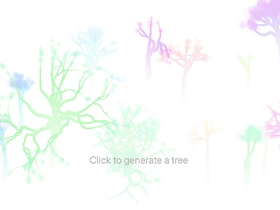
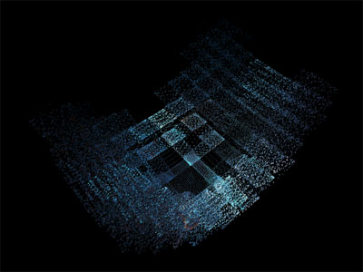

# Paradise

Collection of amazing effects.

[paradise.dtysky.moe](paradise.dtysky.moe)

## Contribute

If you want to join this project and create your effect:  

1. Clone this project and create a branch.
2. Run `npm run create`, then you will see your effect folder is under ./src/collection.
3. Edit ./src/routes/config, add your effect to routes.
4. Run `npm run dev`, open `localhost:8888` to develop.
5. Push your branch and create a merge request to master.

## Current Effects

[RainbowStarWave](http://paradise.dtysky.moe/effect/rainbow-star-wave)  
  

[TreesGenerator2D](http://paradise.dtysky.moe/effect/trees-generator-2d)  
   

[DigitalClock3D](http://paradise.dtysky.moe/effect/digital-clock-3d)  
  

[LottieHelloWorld](http://paradise.dtysky.moe/effect/lottie-hello-world)  
    

[PixelDisplacement2D](http://paradise.dtysky.moe/effect/pixel-displacement-2d)  
    

[Particle3DByThree](http://paradise.dtysky.moe/effect/particle-3d-by-three)  
    

[PanoramaImageViewer](http://paradise.dtysky.moe/effect/panorama-image-viewer)  
    

[ShaderWaterRipple](http://paradise.dtysky.moe/effect/shader-water-ripple)  
    

[ImageFragmentTransition](http://paradise.dtysky.moe/effect/image-fragment-transition)  
    
